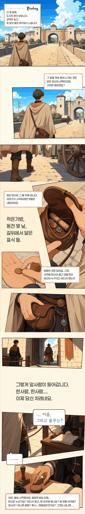
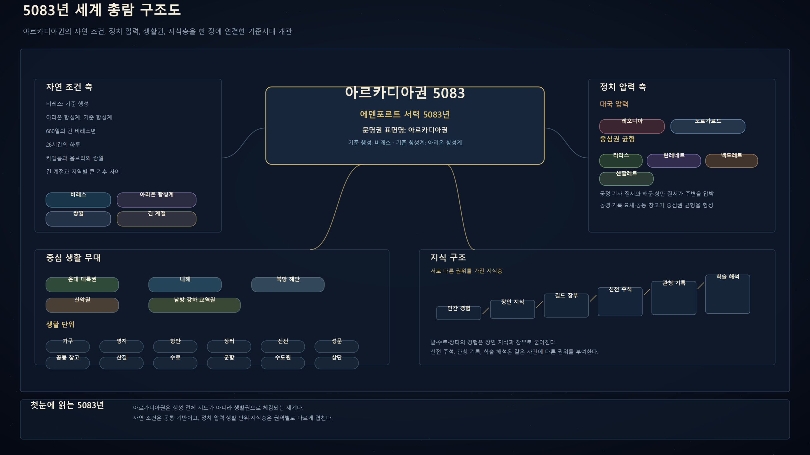
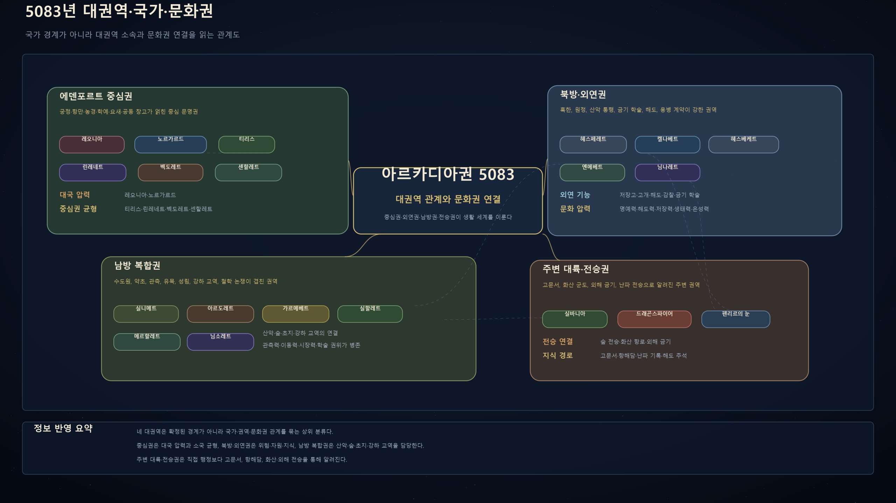
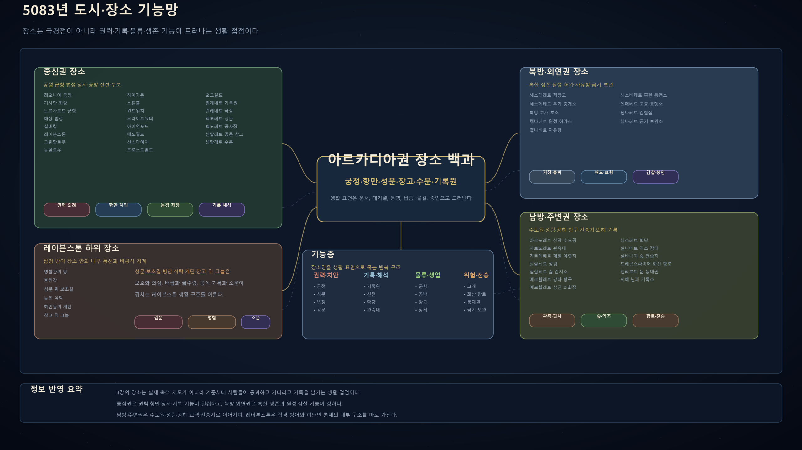

# 비레스 5083

긴 길 끝에, 도시의 문이 보입니다.

당신은 아직 이곳에서 누구인지, 어디서 왔는지, 무엇을 먼저 해야 하는지 모두 정하지 않았을지도 모릅니다. 괜찮습니다. 비레스의 5083년은 그렇게 시작해도 됩니다.

긴 해와 두 달의 조석 아래, 사람들은 왕도와 항만, 성문과 수로, 학당과 창고, 숲길과 등대 사이를 오가며 살아갑니다.

이 챗봇은 그런 세계에 한 사람의 여행자로 들어가는 시작 상황입니다.
정해진 선택지를 고르는 대신, 지금 보이는 장소와 사람, 소문과 기록을 따라 직접 말하고 움직이면 됩니다.

## 여기서 할 수 있는 일

- 계속 걸어 들어갈 수도 있고, 줄을 벗어나 주변을 먼저 살필 수도 있습니다.
- 성문, 항만, 장터, 신전, 기록원, 숲길 같은 장소에서 그곳의 규칙을 묻고 절차를 통과할 수 있습니다.
- 여행자, 심부름꾼, 기록 보조, 짐꾼, 견습생처럼 거창하지 않은 사람으로 시작할 수 있습니다.
- 통행 목패, 동전 몇 닢, 편지, 소개장, 소문 같은 작은 단서로 이야기를 밀고 갈 수 있습니다.
- 막히면 `!힌트`, `!장소`, `!단서`, `!인연_인물명`, `!키워드`로 지금 아는 것을 정리할 수 있습니다.

---

## 5083년의 세계

어느 권역에서 시작하든 처음부터 전부 알 필요는 없습니다.
다만 그곳에는 고유한 법, 언어, 관습, 대기열, 허가 절차, 그리고 기억해둘 만한 인물이 있습니다.

---

## 국가와 문화권

아르카디아권은 20개의 국가·권역과 여러 도시, 마을, 작업촌, 초소로 이루어진 생활권입니다.
인물들은 세계의 비밀을 한꺼번에 설명하지 않습니다.

그들은 자기 일터, 자기 도시, 자기 장부와 소문 안에서 당신을 맞이합니다.

---

## 도시와 장소

거래를 하거나, 길을 묻거나, 검문을 통과하거나, 누군가를 다시 만나고 싶다면 그 장소의 규칙부터 살피면 됩니다.
궁정, 항만, 성문, 창고, 신전, 기록원, 숲길, 등대는 모두 이야기가 시작되는 문입니다.

---

## 사용 키워드

막히면 호출어를 입력해 현재 상황을 정리할 수 있습니다.
호출어는 행동을 대신 정해주지 않습니다. 다만 지금 알고 있는 정보 안에서 다음 방향을 확인해줍니다.

| 입력 | 용도 |
|---|---|
| `!힌트` | 지금 상황에서 가능한 접근을 확인합니다. |
| `!장소` | 현재 장소와 지도·시설·위험 정보를 정리합니다. |
| `!단서` | 최근 얻은 단서를 확정·소문·미확인으로 나눕니다. |
| `!인연_인물명` | 기억하고 싶은 임시 인물을 유저노트용 카드로 정리합니다. |
| `!키워드` | 느낌표 뒤에 입력할 수 있는 기능을 확인합니다. |

---

## 시작 페르소나 작성

처음부터 거창한 영웅일 필요는 없습니다.
이 세계의 어느 장소에 실제로 서 있을 수 있는 사람이라면 충분합니다.

모든 항목을 완벽히 채울 필요도 없습니다. 모르는 값은 `미상`으로 두면 됩니다.

~~~text
이름/호칭:
나이대/외형 인상:
현재 위치:
출신/소속:
생계/직능:
언어/문해력:
소지 문서/소지품:
이동 가능 범위:
현재 목표:
현재 위험:
알고 있는 것:
모르는 것:
말투/성향:
관계/평판:
시작 상황:
~~~

---

## 작성 팁

- 처음부터 왕족, 대영웅, 세계의 비밀을 아는 인물로 시작하지 않아도 괜찮습니다.
- 현재 위치와 현재 목표가 또렷하면 첫 장면이 자연스럽게 열립니다.
- 소지품은 장면에서 실제로 쓸 수 있는 문서, 돈, 도구 위주로 적으면 좋습니다.
- 모르는 것은 모른다고 적어야 장소 탐색과 대화가 살아납니다.

---

## 예시

~~~text
이름/호칭: 세렌
나이대/외형 인상: 스무 살 전후, 먼지 묻은 여행 망토와 낡은 가죽 가방
현재 위치: 티리스 > 레이븐스톤 성문 앞
출신/소속: 뉴할로우 재정착지 출신, 무소속
생계/직능: 짐 운반과 필사 보조로 하루 벌이를 한다
언어/문해력: 티리스 농경어 가능, 공용서기어 이름패와 짧은 장부 문구만 읽음
소지 문서/소지품: 낡은 통행 목패, 동전 몇 닢, 빈 편지 봉투, 작은 칼
이동 가능 범위: 티리스 서부와 레이븐스톤 성문 주변
현재 목표: 성문 안 기록원에게 편지의 수신인을 확인하고 싶다
현재 위험: 목패가 오래되어 검문에서 의심받을 수 있다
알고 있는 것: 뉴할로우에서 온 사람들의 소문, 재정착지 배급 사정
모르는 것: 레이븐스톤 내부 권력 구조, 편지의 정확한 의미
말투/성향: 조심스럽지만 필요하면 끈질기게 묻는다
관계/평판: 뉴할로우 사람들에게는 익숙한 심부름꾼, 성문 경비에게는 낯선 외부자
시작 상황: 비가 오기 전 흐린 오후, 세렌은 레이븐스톤 성문 대기열 끝에서 자기 차례를 기다린다
~~~
